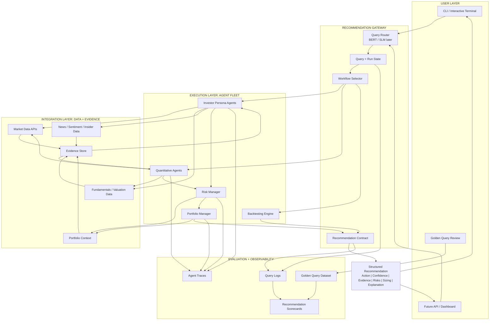

# Nova Trader

Multi-agent AI trading recommendation system for hedge-fund style research, signal generation, portfolio decision support, and optional paper trading execution.

## Architecture

Nova Trader is being shaped as a hedge-fund recommendation engine. The core product loop is: understand the user query, gather the right evidence, run specialized analyst agents, apply risk and portfolio constraints, and return a structured recommendation.



20 specialized analyst agents run in parallel, each producing buy/sell/hold signals with confidence scores. The risk manager validates exposure limits. The portfolio manager aggregates signals and produces recommended actions. The execution layer can optionally send orders to Alpaca paper trading.

See [docs/v0_architecture.md](docs/v0_architecture.md) for the V0 architecture and [docs/three_month_scope.md](docs/three_month_scope.md) for the current product scope.

### How It Works

1. **Analyst agents** analyze a stock from different perspectives — value investing, growth, technicals, sentiment, macro, etc.
2. **12 investor-persona agents** are defined as YAML configs + Jinja2 prompt templates (no boilerplate Python per agent).
3. **6 quantitative agents** run pure calculation — technical indicators, fundamentals, growth metrics, sentiment, news, valuation.
4. **Risk Manager** checks volatility, correlation, and exposure limits.
5. **Portfolio Manager** aggregates all signals and produces recommended trade decisions.
6. **Execution** (optional) sends orders to Alpaca paper trading.

## Quick Start

```bash
# Install dependencies
poetry install

# Configure API keys
cp .env.example .env
# Edit .env with your keys

# Run the recommendation system
poetry run python -m src.main --tickers AAPL,NVDA,TSLA

# Run backtester
poetry run backtester --tickers AAPL --start-date 2024-01-01 --end-date 2024-12-31
```

## Agents

### Investor Personas (YAML-configured)

Each persona is a YAML file defining philosophy, scoring functions, weights, and thresholds. Adding a new persona takes ~60 lines of YAML — zero Python.

| Agent | Style | Focus |
|---|---|---|
| Warren Buffett | Value | Moat analysis, intrinsic value, margin of safety |
| Charlie Munger | Quality | Business quality, management, mental models |
| Ben Graham | Deep Value | Net-net, Graham number, margin of safety |
| Bill Ackman | Activist | Catalyst identification, undervalued with triggers |
| Cathie Wood | Growth | Disruptive innovation, TAM analysis |
| Michael Burry | Contrarian | Short opportunities, overvaluation detection |
| Peter Lynch | GARP | PEG ratio, business simplicity |
| Phil Fisher | Scuttlebutt | Management quality, growth potential |
| Stanley Druckenmiller | Macro | Macro trends, currency/commodity plays |
| Rakesh Jhunjhunwala | Emerging Markets | Growth sectors, macro-driven investing |
| Mohnish Pabrai | Dhandho | Low-risk, high-uncertainty value plays |
| Aswath Damodaran | Valuation | DCF, cost of capital, narrative + numbers |

### Quantitative Agents (Python)

| Agent | Type | What It Computes |
|---|---|---|
| Technical Analyst | Quant | Trend (EMA), momentum, mean reversion (Bollinger/RSI), volatility, stat-arb (Hurst) |
| Fundamentals Analyst | Quant | Financial ratios, earnings quality, profitability |
| Growth Analyst | Quant | Revenue/earnings growth trends |
| Sentiment Analyst | Behavioral | Insider trades pattern analysis |
| News Sentiment | NLP | LLM-powered headline classification |
| Valuation Analyst | Quant | DCF, comparable analysis |

### Orchestration Agents

| Agent | Role |
|---|---|
| **Risk Manager** | Volatility sizing, correlation analysis, exposure limits |
| **Portfolio Manager** | Aggregates all signals, makes final buy/sell/hold decisions |

## Adding a New Investor Persona

Create a YAML file in `src/agents/templates/configs/`:

```yaml
id: "new_agent"
display_name: "New Agent"
persona:
  name: "New Agent"
  philosophy: "Describe their investment philosophy..."
  focus_metrics: ["metric_1", "metric_2"]
  signal_rules: "When to be bullish vs bearish..."
prompt_template: "default.j2"
data:
  period: "ttm"
  limit: 10
  line_items: ["revenue", "net_income"]
scoring:
  - function: "score_roic"
    params: { thresholds: [8, 12, 18] }
  - function: "score_roe"
    params: { thresholds: [10, 15, 22] }
weights:
  score_roic: 0.5
  score_roe: 0.5
thresholds:
  bullish: 0.6
  bearish: 0.4
```

That's it. The agent is automatically discovered and runs alongside all others.

## Project Structure

```
nova-trader/
├── pyproject.toml
├── src/
│   ├── main.py                     # CLI entry point
│   ├── orchestrator/
│   │   └── pipeline.py             # Parallel orchestration (ThreadPoolExecutor)
│   ├── execution/
│   │   ├── base.py                 # Abstract broker interface
│   │   └── alpaca.py               # Alpaca paper trading
│   ├── agents/
│   │   ├── harness.py              # Template agent engine
│   │   ├── scoring.py              # 16 composable scoring functions
│   │   ├── loader.py               # YAML config auto-discovery
│   │   ├── templates/
│   │   │   ├── configs/            # 12 investor persona YAMLs
│   │   │   └── prompts/            # Jinja2 prompt templates
│   │   ├── technicals.py           # Technical analysis (5 strategies)
│   │   ├── fundamentals.py         # Fundamentals analysis
│   │   ├── growth_agent.py         # Growth metrics
│   │   ├── sentiment.py            # Insider trade sentiment
│   │   ├── news_sentiment.py       # News headline analysis
│   │   ├── valuation.py            # DCF / comparables
│   │   ├── risk_manager.py         # Risk controls
│   │   └── portfolio_manager.py    # Final decision maker
│   ├── tools/                      # Financial data API
│   ├── data/                       # Models, cache
│   ├── llm/                        # Multi-provider LLM abstraction
│   ├── router/                     # Query routing contracts
│   ├── recommender/                # Recommendation output contracts
│   ├── backtesting/                # Backtest engine
│   └── utils/                      # Display, progress, helpers
├── docs/                           # Architecture and planning docs
└── tests/
```

## LLM Providers

Nova Trader supports multiple LLM providers out of the box:

- OpenAI (GPT-4o, GPT-4o-mini)
- Anthropic (Claude Sonnet, Haiku)
- Google (Gemini)
- Groq (Llama, Mixtral)
- DeepSeek
- Ollama (local models)
- OpenRouter (any model)

Configure via `--model-provider` and `--model-name` CLI flags.
