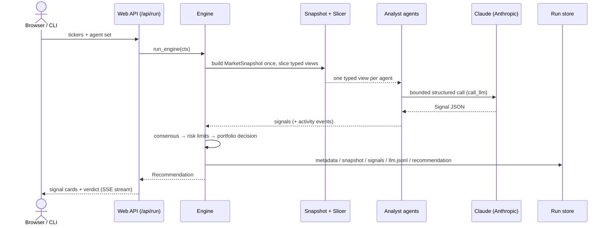
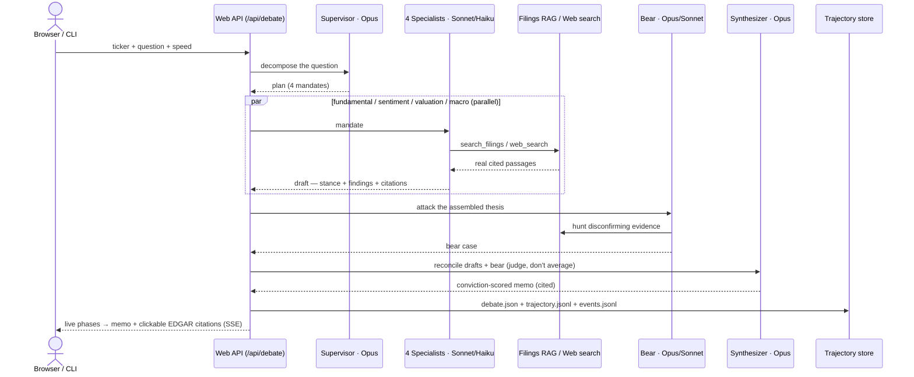

# Nova Trader

A typed, auditable equity-research engine. Typed market data in → structured, cited recommendation out — with an optional multi-agent **research-desk debate** for deep, question-driven analysis. No LangChain, no graph runtime; deterministic code owns the data, the boundaries, and the persistence.

Runs on two surfaces (terminal **CLI** and a **web app**) and two analysis modes (**Signals** and **Debate**). Anthropic Claude is the default provider.

---

## Quickstart

```bash
poetry install
cp .env.example .env          # set ANTHROPIC_API_KEY (default provider)
```

```bash
poetry run nova web                                   # browser app on http://127.0.0.1:8000
poetry run nova run AAPL,NVDA                          # deterministic Signals run (CLI)
poetry run nova debate NVDA "Is AI-accelerator growth durable?" --quick   # one-shot Debate
poetry run nova                                        # interactive chat TUI
poetry run nova show <run_id> | rerun <run_id>         # inspect / replay a saved run
```

Minimal `.env`:

```text
ANTHROPIC_API_KEY=sk-ant-...
NOVA_MODEL_PROVIDER=Anthropic
NOVA_MODEL_NAME=claude-opus-4-8
FINANCIAL_DATASETS_API_KEY=...        # primary market data (yfinance fallback for prices/metrics)
TAVILY_API_KEY=...                    # web search (DuckDuckGo fallback otherwise)
SEC_USER_AGENT=nova-trader/0.1 you@example.com
```

---

## Two modes

| | **Signals** (deterministic council) | **Debate** (research desk) |
|---|---|---|
| Input | tickers + agent set | one ticker + a free-text **question** + horizon + evidence source |
| Engine | 9 default analysts score the ticker → consensus → risk limits → portfolio decision | supervisor → 4 parallel specialists → bear → synthesizer |
| Models | bounded JSON per agent (any provider) | Anthropic only: Opus (reason) + Sonnet/Haiku (specialists) |
| Output | buy/hold/sell + reasoning + risk limits | cited, conviction-scored memo (bull/base/bear, risks) |
| Speed/cost | ~30–90s, cheap | minutes (see tiers below) |

The LLM is used only for **bounded JSON decisions and persona/research reasoning**. Deterministic code owns snapshots, view boundaries, aggregation, risk limits, hedge pairing, persistence, and replay.

---

## Architecture

```text
nova run / /api/run
  build MarketSnapshot once → slice typed per-agent views → run analyst agents
  → consensus → risk manager → portfolio manager → write Recommendation + audit files

nova debate / /api/debate
  supervisor decomposes the question → 4 specialists research in parallel (filings/web)
  → bear challenges the thesis → synthesizer reconciles → cited memo + saved trajectory
```

| Area | Files |
|---|---|
| Deterministic engine | `src/engine.py`, `src/registry.py`, `src/snapshot.py`, `src/slicer.py`, `src/agents/*`, `src/agents/scoring.py` |
| Risk / portfolio | `src/agents/risk.py`, `src/agents/portfolio.py` |
| Debate engine | `src/debate/engine.py` (supervisor→specialists→bear→synth), `src/debate/filings_rag.py` (EDGAR + BM25), `src/debate/recorder.py` (trajectory), `src/debate/local_fallback.py` |
| LLM providers | `src/utils/llm.py` (Anthropic `messages.parse` + streaming; OpenAI-compatible; Azure; Ollama) |
| Web app | `src/web/server.py` (FastAPI + SSE), `src/web/static/index.html` |
| CLI | `src/cli.py` (`run`/`show`/`rerun`/`web`/`debate`), `src/chat_cli.py` (chat TUI) |
| Typed contracts | `src/schemas/*`, citations in `src/schemas/signals.py` |
| Run persistence | `src/runs.py`, `src/debate/recorder.py` |

### Swimlane — Signals (`/api/run`)



### Swimlane — Debate (`/api/debate`)



### Debate speed tiers

| Tier | Specialists | Bear | Live web | ~Time |
|---|---|---|---|---|
| full | Sonnet | Opus | yes | ~8 min |
| fast | Haiku | Opus | yes | ~5 min |
| quick | Haiku | Sonnet | no | ~3–4 min |

---

## Data sources

Primary financial data is **financialdatasets.ai**; yfinance (Yahoo) is a fallback for prices/metrics only.

| Analyst | Source |
|---|---|
| `technical` | prices — financialdatasets.ai (→ yfinance) |
| `fundamentals` / `growth` / `valuation` | financial metrics + line items — financialdatasets.ai |
| `news_sentiment` | company news — financialdatasets.ai |
| `insider_sentiment` | insider trades — financialdatasets.ai |
| `web_research` / `adaptive_research` | Tavily (→ DuckDuckGo) + SEC EDGAR |
| `sec_filings` | SEC EDGAR 10-K / 10-Q |
| debate specialists | SEC EDGAR filings (BM25 index) **or** Anthropic live web search |

---

## Resilience & guarantees (debate)

- **Trajectories are persisted** for audit/evaluation/training: `debate.json` (plan, drafts, bear, memo, timings), `trajectory.jsonl` (every LLM call's prompt + response + token usage), `events.jsonl` (full progress + tool-call stream) under `~/.nova-trader/runs/debate-<id>/`.
- **Runs survive a dropped connection.** The worker is decoupled from the SSE stream; a closed tab does not abort it, and the browser recovers the memo by `run_id` via `/api/debate/result`. An explicit **Close** cooperatively cancels the run to stop spending tokens.
- **Always finishes with a memo.** The bear (`NOVA_DEBATE_BEAR_TIMEOUT`, default 300s) and synthesizer (`NOVA_DEBATE_SYNTH_TIMEOUT`, 180s) are time-capped; on timeout the run degrades (placeholder bear / drafts-assembled memo) rather than hanging. One failing specialist returns a neutral fallback draft instead of aborting the parallel set.
- **Citations are real and safe.** Each citation is a filing chunk-ID (`NVDA-10K-0309`) mapped to its SEC EDGAR document URL, or a web URL — rendered as clickable chips. URLs are scheme-gated (http/https only); `run_id` query params are validated before any filesystem access.

---

## Run artifacts

Every recorded run is written under `~/.nova-trader/runs/<run_id>/`:

```text
# Signals run                  # Debate run (debate-<ticker>-<id>/)
metadata.json                  debate.json
snapshot.json                  trajectory.jsonl
views.jsonl                    events.jsonl
signals.jsonl
llm.jsonl
recommendation.json
```

---

## Agents (Signals)

Registered in `src/registry.py`. Add one by appending an `AgentSpec` and implementing a runner:

```python
def run_agent(ctx: RunContext, view: SomeView, recorder=None) -> Signal: ...
```

| Agent | Purpose |
|---|---|
| `technical` | trend, momentum, mean reversion, volatility |
| `fundamentals` / `growth` / `valuation` | profitability, growth, valuation |
| `news_sentiment` / `insider_sentiment` | sentiment signals |
| `web_research` / `sec_filings` / `adaptive_research` | live web + filings evidence, with citations |
| `warren_buffett` | quality/value persona (LLM JSON) |

The engine owns snapshot slicing, execution, signal recording, aggregation, risk, portfolio construction, and recommendation assembly.

---

## LLM providers

Direct SDK/HTTP adapters in `src/utils/llm.py` (no LangChain):

- **Anthropic (Claude — default: `claude-opus-4-8`)**
- OpenAI · Azure OpenAI · OpenRouter · DeepSeek · Groq · MiniMax · xAI · Ollama

Debate model overrides: `NOVA_DEBATE_REASONING_MODEL`, `NOVA_DEBATE_SPECIALIST_MODEL`, `NOVA_DEBATE_BEAR_TIMEOUT`, `NOVA_DEBATE_SYNTH_TIMEOUT`.

---

## Testing

```bash
poetry run pytest -q
```
