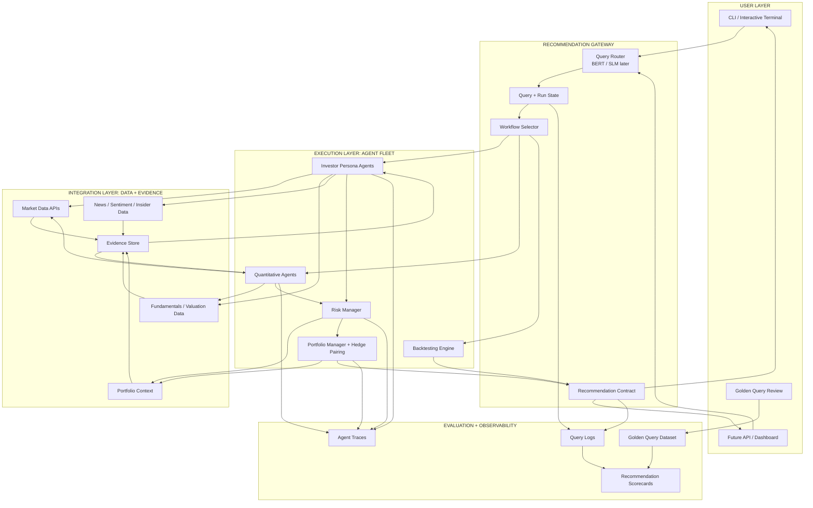

# Nova Trader V0 Architecture

Nova Trader V0 should be scoped around one clear product direction: a hedge-fund style equity recommendation engine with optional long/short construction. The system should help an investment user ask a market, portfolio, risk, valuation, or backtesting question and receive a structured recommendation backed by data, multiple analyst agents, risk checks, portfolio-aware sizing, and evidence.

The architecture below adapts the layered agent-platform pattern to Nova Trader. The important idea is that the interface can stay simple in V0, but the backend should already be shaped like a real recommendation system.

## Layer Responsibilities

The user layer is intentionally lightweight in V0. The current CLI and interactive terminal are enough for early usage, while a dashboard or API can come later. The most important thing is that users can ask realistic investment questions and see structured recommendation outputs.

The recommendation gateway is the product control plane. It receives the user query, tracks query and run state, routes the request to the correct workflow, and enforces a consistent recommendation contract. The router should eventually be backed by a BERT or small language model, but the contract should be stable before the model becomes important.

The execution layer is the agent fleet. This is where the current analyst agents, quantitative agents, risk manager, portfolio manager, hedge-pairing logic, and backtesting engine live. The agents should not just produce prose. They should produce structured opinions that can be compared, audited, scored, and fed into portfolio-aware recommendation logic.

The integration layer is the data and evidence foundation. It gathers market prices, fundamentals, valuation inputs, news, sentiment, insider activity, and portfolio context. Over time this should become an evidence store so the system can explain why it made a recommendation and which facts supported the answer.

The evaluation layer is what makes this a product instead of a demo. Every query, route, agent output, recommendation, and user-facing answer should be logged. A golden dataset of 10 to 12 representative question-answer pairs should be used as the first benchmark, so each iteration can be measured against expected answers.

## V0 Product Flow

In V0, the ideal flow is simple. A user asks a question such as whether to buy a stock, compare two equities, review portfolio risk, or run a backtest. The gateway converts that question into a structured route, selects the right workflow, pulls the required data, runs the relevant agents, applies risk and portfolio constraints, and returns a recommendation with action, optional hedge, confidence, conviction, evidence, risks, sizing, and explanation.

The core principle is that the system should compute the recommendation, while the language model explains it. This keeps the product grounded in data, agent outputs, and risk logic instead of becoming a generic chatbot.

In explicit equity long/short mode, a buy recommendation is not considered complete by itself. The structured recommendation or portfolio manager layer must either attach a short hedge candidate or block/reduce the buy until a hedge is available. In default research mode, the system should show the signal directly so users are not confused by hidden hedge blocking.

## V0 Scope Boundaries

V0 should focus on recommendation quality, structure, and evaluation. It does not need to be a full trading platform. Paper execution can remain optional, and live execution should not be the main focus. The priority should be to make the recommendation loop reliable enough that hedge-fund style users can test it, challenge it, and help shape the next direction.
